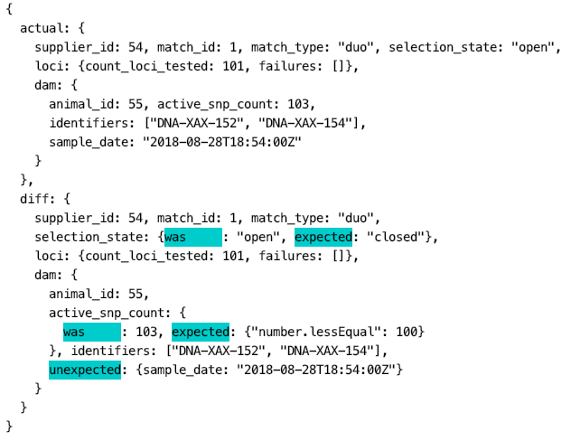

# Diff Tree

A `diff tree` is a Javascript object/array that shows the differences between an actual and expected value.
It is especially useful when dealing with nested objects/arrays where most of structure is the same.
This makes it easier to see the difference within its context. 

A `diff tree` has some of the properties of a traditional diff, but instead of showing differences at the line level, 
it shows them at the JS token level.

For example, consider the following test with `mismatched`:

```
        it("Nested with two differences", () => {
            assertThat({
                supplier_id: 54,
                match_id: 1,
                match_type: "duo",
                selection_state: "open",
                loci: {count_loci_tested: 101, failures: []},
                dam: {
                    animal_id: 55,
                    active_snp_count: 103,
                    identifiers: [
                        "DNA-XAX-152", "DNA-XAX-154"
                    ],
                    sample_date: "2018-08-28T18:54:00Z"
                }
            }).is({
                supplier_id: 54,
                match_id: 1,
                match_type: "duo",
                selection_state: "closed",
                loci: {count_loci_tested: 101, failures: []},
                dam: {
                    animal_id: 55,
                    active_snp_count: match.number.lessEqual(100),
                    identifiers: [
                        "DNA-XAX-152", "DNA-XAX-154"
                    ],
                    sample_date: "2018-08-28T18:54:00Z"
                }
            });
        });
```

The`assertThat()` shows both the actual value and the tree-diff when there is a mismatch:



Notice that:

 - Each difference is shown as an object with a `was` and `expected` field, where those fields are coloured to draw the eye.
 - Matchers provide sufficient detail clarify what they expected

There are two differences shown in the `diff`:

 - the `selection_state` was not "closed", as expected.
 - the `active_snp_count` was 103, which is not the number expected ( <= 100).

